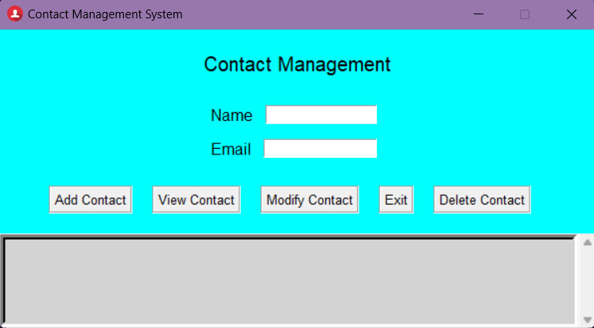

#  📘 Contact Management System

# Description:
This Contact Management System is a Python application designed to store, retrieve, and manage contacts.
Whether you prefer a sleek, straightforward text interface or a visually engaging GUI, this system is designed to cater
to your needs.

# Features:
- Add with ease: Effortlessly add contacts with just your name and email.
- View at a glance: Get an overview of your contacts in a readable format.
- Editing: Modify your contacts with a few clicks/key presses.
- Dual interfaces: You can choose between the snappy text-based interface or the intuitive GUI. Your choice, your comfort.
- Storage: Your contacts are safely stored in a JSON file, making data loss a thing of a past.

# Prerequisites
Make sure you have Python installed and have the latest version of git. 'tkinter' comes pre-installed with Python.
- run git clone https://github.com/AngelX62/ContactManager.git
- Load in directory: cd ContactManager
- run python main.py

# System:
- Text Mode: Follow the intuitive prompts.
- GUI Mode: A window to a simpler world of contact management opens up.

# Contribution
Feel free to fork the repo and make your changes stand out with a pull request.

# License
This project is under the MIT License.

